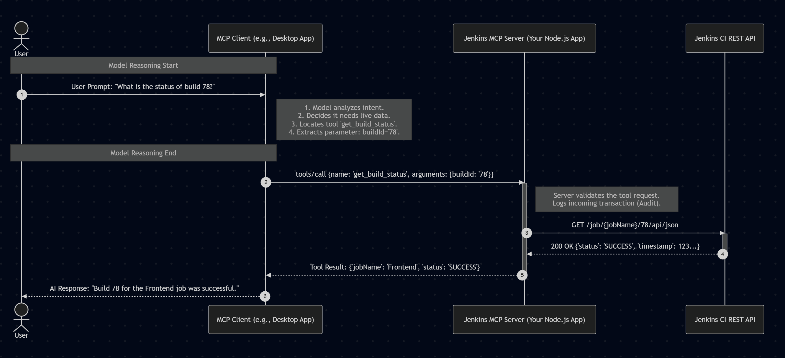
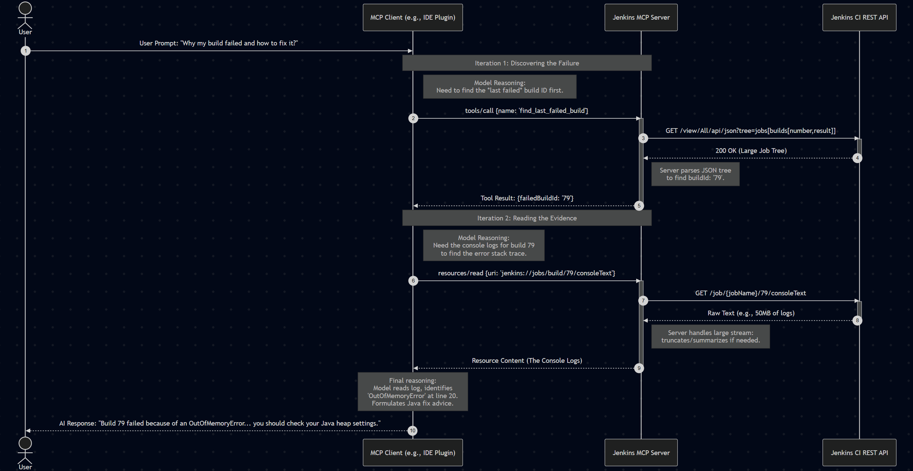

# Jenkins Industrial-Grade MCP Server

A powerful Model Context Protocol (MCP) server that brings Jenkins CI/CD insights directly into your AI-powered development tools (like Claude Desktop, Cursor, and the MCP Inspector).

## Features

- **Automated CSRF Protection**: Built-in support for fetching and applying Jenkins "Crumb" tokens for secure production environments.
- **Deep Job Insights**: Tools to search for jobs, fetch detailed configurations, and list recent build histories.
- **Log Streaming**: Resource handlers to fetch full console logs for any specific build.
- **Safety Guardrails**: Critical actions like triggering or stopping builds require a `confirmed: true` flag.
- **Dual Transport**: Supports both **STDIO** (standard input/output) and **SSE** (HTTP-based Server-Sent Events).

## Getting Started (Docker Compose)

The easiest way to test the full stack (Jenkins + MCP Server) is using Docker Compose.

### 1. Configure Credentials
Create a `.env` file in the root directory:
```env
JENKINS_URL=http://localhost:8081
JENKINS_USER=admin
JENKINS_TOKEN=your_jenkins_api_token
```

### 2. Launch the Stack
```bash
docker compose up -d --build
```
- **Jenkins**: Accessible at [http://localhost:8081](http://localhost:8081)
- **MCP Server**: Running in the background as `jenkins-mcp-server`

---

## Testing & Inspection

To verify the server tools and resources, use the **MCP Inspector**.

### Option A: Using the Integrated Stack (Fastest)
If you have the server running via Docker Compose, "attach" to it:
```bash
npx @modelcontextprotocol/inspector -- \
  docker exec -i jenkins-mcp-server node build/index.js
```

### Option B: Testing the Standalone Image (Portable)
If you want to test the built image in isolation (simulating how an IDE would run it):
```bash
npx @modelcontextprotocol/inspector -- \
  docker run -i --rm --network="host" --env-file .env jenkins-mcp-server
```

---

## Available Tools

- `list_jobs`: Discover all available jobs.
- `search_jobs`: Filter jobs by name pattern.
- `get_job_info`: Get job parameters, description, and history.
- `list_builds`: List recent builds for a specific job.
- `get_build_status`: Detailed results for a specific build.
- `trigger_build`: Start a new build (supports parameters + safety check).
- `stop_build`: Abort a running build (with safety check).

## Available Resources

- `jenkins://{job}/logs/{id}`: Fetch the full plain-text console output for any build.

---

## Development & SSE Mode

To run the server locally with a standalone Jenkins instance using the **SSE (HTTP)** transport:

```bash
# Install dependencies
npm install

# Compile TypeScript
npm run build

# Start in SSE mode
export TRANSPORT=sse
export PORT=3000
npm start
```

## Reference Images


